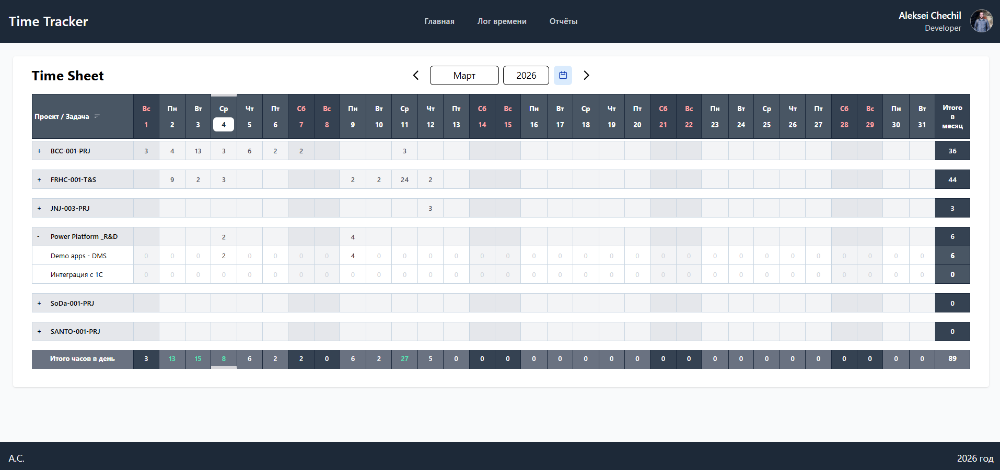

# 🕒 Time Tracker App

**Time Tracker** — веб-приложение для учета рабочего времени сотрудников с интерактивной таблицей проектов и задач.

---

## 🚀 Основные возможности

- ✅ Просмотр назначенных проектов и задач
- ✅ Внесение часов и комментариев
- ✅ Подсветка текущего дня и выходных
- ✅ Sticky header таблицы при прокрутке
- ✅ Hover подсказки и гайдлайны на ячейках
- ✅ Автоматическое суммирование часов по дням и месяцу
- ✅ Уведомления через Toast (`react-toastify`)

---

## 🧩 Технологии

- **React 18+**, **TypeScript**
- **TailwindCSS** для стилизации
- **React Toastify** для уведомлений
- **Power Apps & MS Graph API** для данных пользователя
- **OData фильтры** для запросов проектов и часов

---

## 📂 Структура проекта

# 🕒 Time Tracker App

**Time Tracker** — веб-приложение для учета рабочего времени сотрудников с интерактивной таблицей проектов и задач.

---

## 🚀 Основные возможности

- ✅ Просмотр назначенных проектов и задач
- ✅ Внесение часов и комментариев
- ✅ Подсветка текущего дня и выходных
- ✅ Sticky header таблицы при прокрутке
- ✅ Hover подсказки и гайдлайны на ячейках
- ✅ Автоматическое суммирование часов по дням и месяцу
- ✅ Уведомления через Toast (`react-toastify`)

---

## 🧩 Технологии

- **React 18+**, **TypeScript**
- **TailwindCSS** для стилизации
- **React Toastify** для уведомлений
- **Power Apps & MS Graph API** для данных пользователя
- **OData фильтры** для запросов проектов и часов

---

## 📂 Структура проекта
Project/
├─ public/
│  └─ site-icon-TS.svg
├─ src/
│  ├─ assets/
│  │  └─ react.svg
│  ├─ constants/
│  │  └─ table.ts
│  ├─ generated/
│  │  ├─ models/
│  │  │  ├─ CommonModels.ts
│  │  │  ├─ Office365UsersModel.ts
│  │  │  ├─ Projects_assignmentModel.ts
│  │  │  ├─ Projects_codeModel.ts
│  │  │  ├─ TasksModel.ts
│  │  │  └─ TimeEntriesModel.ts
│  │  └─ services/
│  │     ├─ Office365UsersService.ts
│  │     ├─ Projects_assignmentService.ts
│  │     ├─ Projects_codeService.ts
│  │     ├─ TasksService.ts
│  │     └─ TimeEntriesService.ts
│  ├─ pages/
│  │  └─ TimeSheetPage/
│  │     └─ TimeSheetPage.tsx
│  ├─ shared/
│  │  ├─ api/
│  │  │  ├─ useGetTimeEnries.ts
│  │  │  ├─ useSaveData.ts
│  │  │  ├─ useTimeSheetData.ts
│  │  │  ├─ useTimeSheetDataBackUp.ts
│  │  │  └─ useUser.ts
│  │  ├─ hooks/
│  │  │  └─ useTimeEntries.ts
│  │  ├─ sceletonLoading/
│  │  │  └─ LoaderTable.tsx
│  │  ├─ types/
│  │  │  └─ sharedtypes.ts
│  │  └─ utils/
│  │     ├─ calculateCoordinates.ts
│  │     └─ GetDate.ts
│  └─ widgets/
│     ├─ Footer/
│     │  └─ Footer.tsx
│     ├─ Header/
│     │  └─ Header.tsx
│     └─ TimeSheetTable/
│        ├─ TimeSheetRowTask.tsx
│        ├─ TimeSheetTable.tsx
│        ├─ timsSheetRowProject.tsx
│        └─ components/
│           ├─ AddTimeEntryPopup.tsx
│           ├─ HoverCellPopup.tsx
│           ├─ HoverGuidlines.tsx
│           └─ MonthYearSwitch.tsx
├─ App.tsx
├─ main.tsx
├─ index.css
├─ package.json
├─ package-lock.json
├─ vite.config.ts
├─ tailwind.config.js
├─ postcss.config.cjs
├─ tsconfig.json
├─ tsconfig.app.json
├─ tsconfig.node.json
├─ eslint.config.js
├─ .gitignore
└─ README.md

## 📄 Краткое описание файлов

| Путь | Назначение |
|------|------------|
| `src/App.tsx` | Главный компонент приложения. Подключает Header, Footer, TimeSheetPage, ToastContainer |
| `src/main.tsx` | Точка входа в приложение (React + Vite) |
| `src/index.css` | Глобальные стили, Tailwind |
| `src/constants/table.ts` | Константы и конфигурации таблицы таймшита |
| `src/generated/models/*.ts` | Типы моделей данных (Tasks, Projects, Users, TimeEntries) |
| `src/generated/services/*.ts` | Сервисы для работы с API (OData) |
| `src/pages/TimeSheetPage/TimeSheetPage.tsx` | Страница таймшита, оборачивает TimeSheetTable |
| `src/shared/api/useTimeSheetData.ts` | Хук для загрузки и обработки данных таймшита |
| `src/shared/api/useSaveData.ts` | Хук для сохранения введенных часов |
| `src/shared/api/useUser.ts` | Хук для получения информации о пользователе |
| `src/shared/hooks/useTimeEntries.ts` | Хук для работы с TimeEntries в UI |
| `src/shared/utils/GetDate.ts` | Утилита для получения дней месяца с днями недели |
| `src/shared/utils/calculateCoordinates.ts` | Утилита для вычисления координат курсора в таблице |
| `src/shared/types/sharedtypes.ts` | Общие типы и интерфейсы (PopupData, days и др.) |
| `src/widgets/Header/Header.tsx` | Компонент шапки приложения, отображение пользователя |
| `src/widgets/Footer/Footer.tsx` | Компонент подвала |
| `src/widgets/TimeSheetTable/TimeSheetTable.tsx` | Основная таблица таймшита, объединяет строки и попапы |
| `src/widgets/TimeSheetTable/TimeSheetRowTask.tsx` | Компонент строки задачи |
| `src/widgets/TimeSheetTable/timsSheetRowProject.tsx` | Компонент строки проекта (группировка задач) |
| `src/widgets/TimeSheetTable/components/AddTimeEntryPopup.tsx` | Попап для добавления часов |
| `src/widgets/TimeSheetTable/components/HoverCellPopup.tsx` | Подсказка при наведении на ячейку |
| `src/widgets/TimeSheetTable/components/HoverGuidlines.tsx` | Вертикальные и горизонтальные гайдлайны при наведении |
| `src/widgets/TimeSheetTable/components/MonthYearSwitch.tsx` | Компонент переключения месяца/года |

### 🔹 Как это выглядит логически

- **App.tsx** — основной контейнер приложения  
- **pages/TimeSheetPage** — страница таймшита  
- **widgets/Header, Footer** — шапка и футер  
- **widgets/TimeSheetTable** — вся логика таблицы и её строки  
- **shared/api** — функции работы с данными (API)  
- **shared/hooks** — кастомные React-хуки  
- **shared/utils** — утилиты, например, для расчета координат и дней месяца  
- **generated/** — сгенерированные модели и сервисы OData  

