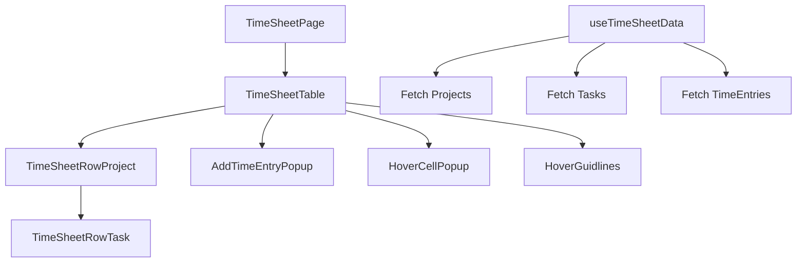

# Code Review Summary

## Project Overview
Time Tracker PA is a React/TypeScript application for tracking time entries across projects and tasks. The codebase uses generated API clients, custom hooks, and a table-based UI.

## Key Findings

### Critical Bugs
1. **TimeEntries State Not Synced** (`TimeSheetTable.tsx`)
   - Local `timeEntries` state initialized from `initialTimeEntries` but does not update when prop changes (month switch).
   - **Fix**: Add `useEffect` to sync state with prop.

2. **Hook Violation** (`TimeSheetTable.tsx`)
   - `saveTimeEntry()` hook called inside `handleSubmit` event handler.
   - **Fix**: Move hook call to top level of component.

3. **Infinite Loading** (`useTimeSheetData.ts`)
   - `loadingProfile` remains `true` when `userProfile` is missing, causing perpetual loading.
   - **Fix**: Set `loadingProfile(false)` before early return or handle missing profile.

4. **Key Duplicates** (`TimeSheetRowTask.tsx`, `timsSheetRowProject.tsx`)
   - Using `day.day` as React key can cause duplicates across months.
   - **Fix**: Use `day.date` which is unique.

### Performance Issues
1. **O(n²) Calculations** (`timsSheetRowProject.tsx`)
   - Filter and reduce inside `map` for each day leads to quadratic complexity.
   - **Fix**: Precompute totals per project-day using memoization.

2. **Unnecessary Re-renders**
   - Event handlers recreated on each render (e.g., `handleHoursChange`).
   - **Fix**: Wrap with `useCallback`.

3. **Expensive Recomputations**
   - Total sum in `TimeSheetRowTask` recalculated on every render.
   - **Fix**: Memoize with `useMemo`.

### Code Quality Improvements
1. **Type Safety**
   - Replace `any` with concrete types (e.g., `taskId: number`).
   - Remove commented‑out code.

2. **Naming Consistency**
   - Rename `timsSheetRowProject.tsx` → `TimeSheetRowProject.tsx`.

3. **Accessibility**
   - Add `aria-label` to icon buttons (ellipsis, month switcher).
   - Ensure keyboard navigation works.

4. **Error Handling**
   - Improve error boundaries and user feedback.

### Architectural Suggestions
1. **State Management**
   - Consider using Zustand or React Query for shared state (timeEntries, projects) to reduce prop drilling.

2. **Separation of Concerns**
   - Move data‑fetching logic into services; keep components focused on UI.

3. **Testing**
   - Add unit tests for utilities (`GetDate`, `calculateCoordinates`).
   - Integration tests for critical user flows.

## Recommended Actions (Priority Order)

### High Priority (Fix Immediately)
1. Sync `timeEntries` with `initialTimeEntries`.
2. Fix hook violation in `TimeSheetTable`.
3. Resolve infinite loading in `useTimeSheetData`.

### Medium Priority (Improve Stability)
4. Replace `any` types with proper TypeScript definitions.
5. Memoize expensive calculations.
6. Fix React key duplicates.

### Low Priority (Enhancements)
7. Improve accessibility.
8. Refactor duplicated logic.
9. Add unit tests.

## Next Steps
I recommend switching to **Code mode** to implement the fixes. The todo list below outlines the specific tasks.

### Todo List for Implementation
- [ ] Fix TimeEntries sync bug in `TimeSheetTable.tsx`
- [ ] Move `saveTimeEntry` hook call to top level
- [ ] Fix `loadingProfile` in `useTimeSheetData.ts`
- [ ] Update React keys to use `day.date`
- [ ] Memoize totals in `TimeSheetRowTask` and `timsSheetRowProject`
- [ ] Replace `any` types with `number`
- [ ] Rename `timsSheetRowProject.tsx`
- [ ] Add `aria-label` to buttons
- [ ] Remove commented‑out code
- [ ] Add unit tests for utilities

## Diagrams

## Conclusion
The codebase is functional but has several issues that could affect user experience and maintainability. Addressing the critical bugs first will stabilize the application, followed by performance and quality improvements.

---
*Review conducted by SourceCraft Code Assistant Agent on 2026-03-06.*